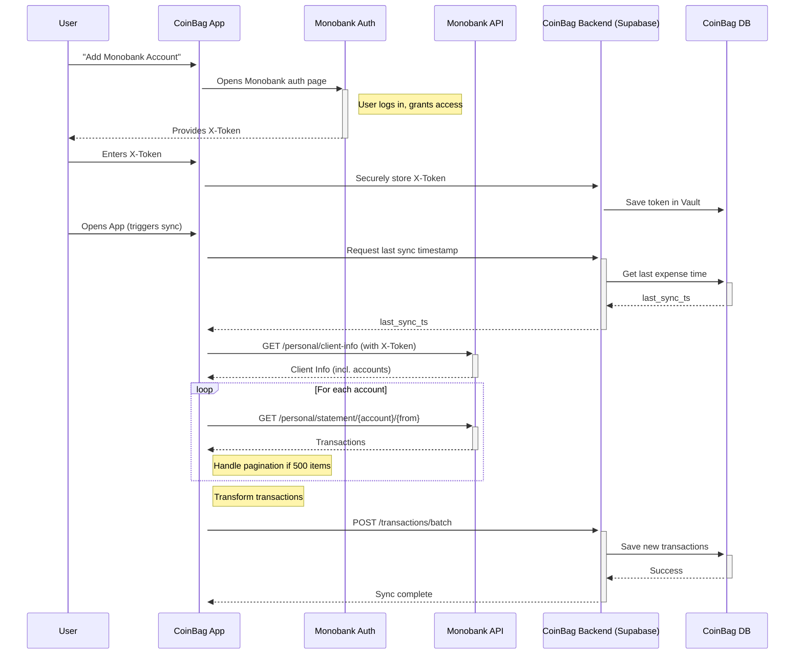

# Monobank Integration Plan

This document outlines the plan for integrating Monobank for bank synchronization.

## 1. Monobank Integration

Monobank will be our first bank sync integration. It will provide us with user's transactions.

## 2. Access Token

To connect to Monobank, we need an access token. The user will obtain this token through a webview. The app should not be part of the token acquisition process directly but will initiate the redirect to `https://api.monobank.ua`.

## 3. Token Input

After the user receives the access token, the app should provide an input field for the user to enter the token.

## 4. Synchronization Process

Once the token is entered, the sync process begins:

### 4.1. Fetch Client Info

We will fetch client information from `https://api.monobank.ua/personal/client-info` using the `X-Token` header.

**Example Payload:**

```json
{
  "clientId": "3MSaMMtczs",
  "name": "Мазепа Іван",
  "webHookUrl": "https://example.com/some_random_data_for_security",
  "permissions": "psfj",
  "accounts": [
    {
      "id": "kKGVoZuHWzqVoZuH",
      "sendId": "uHWzqVoZuH",
      "balance": 10000000,
      "creditLimit": 10000000,
      "type": "black",
      "currencyCode": 980,
      "cashbackType": "UAH",
      "maskedPan": [
        "537541******1234"
      ],
      "iban": "UA733220010000026201234567890"
    }
  ],
  "jars": [
    {
      "id": "kKGVoZuHWzqVoZuH",
      "sendId": "uHWzqVoZuH",
      "title": "На тепловізор",
      "description": "На тепловізор",
      "currencyCode": 980,
      "balance": 1000000,
      "goal": 10000000
    }
  ]
}
```

### 4.2. Fetch Statements

We will fetch transaction statements from `https://api.monobank.ua/personal/statement/{account}/{from}/{to}`.

### 4.3. Data Sync Logic

When the app opens, it will:
1.  Fetch the latest expense timestamp from our cloud.
2.  Use this timestamp as the `from` date for each synced account to load new transactions from Monobank.
3.  Transform the new transaction data.
4.  Funnel the transformed data to our backend as a batch.

**Example Monobank Expense Payload:**

```json
[
  {
    "id": "ZuHWzqkKGVo=",
    "time": 1554466347,
    "description": "Покупка щастя",
    "mcc": 7997,
    "originalMcc": 7997,
    "hold": false,
    "amount": -95000,
    "operationAmount": -95000,
    "currencyCode": 980,
    "commissionRate": 0,
    "cashbackAmount": 19000,
    "balance": 10050000,
    "comment": "За каву",
    "receiptId": "XXXX-XXXX-XXXX-XXXX",
    "invoiceId": "2103.в.27",
    "counterEdrpou": "3096889974",
    "counterIban": "UA898999980000355639201001404",
    "counterName": "ТОВАРИСТВО З ОБМЕЖЕНОЮ ВІДПОВІДАЛЬНІСТЮ «ВОРОНА»"
  }
]
```

### 4.4. Token Storage

The Monobank access token will be stored securely on the backend, likely in Supabase Vault, for reuse.

### 4.5. Pagination

The expenses request has a limit of 500 entries. If we receive 500 entries, we need to make another request with an adjusted time range (using the timestamp of the last transaction) to fetch the remaining transactions.

## 5. Synced Account Behavior

Accounts synced with Monobank will be read-only. This means:
*   The account balance cannot be manually changed within the app.
*   Manual expenses cannot be added to synced accounts.
*   For transactions imported from Monobank, users will only be able to edit the category and tags.

## 6. Data Flow

